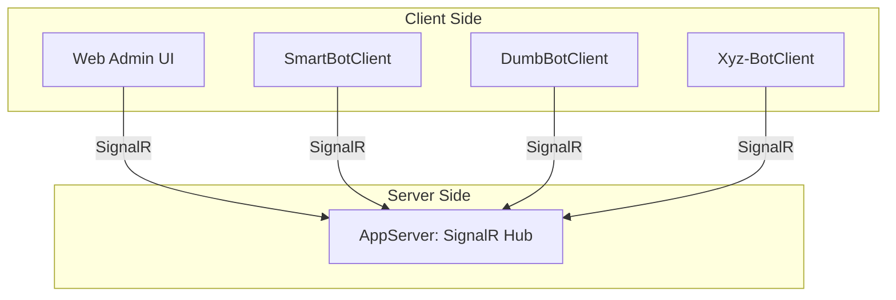
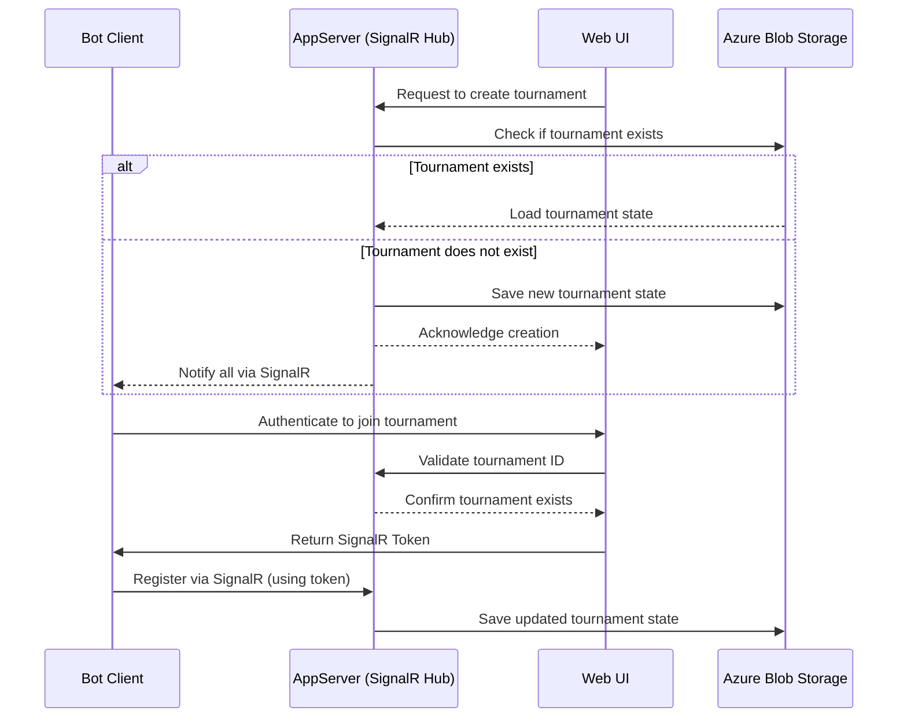
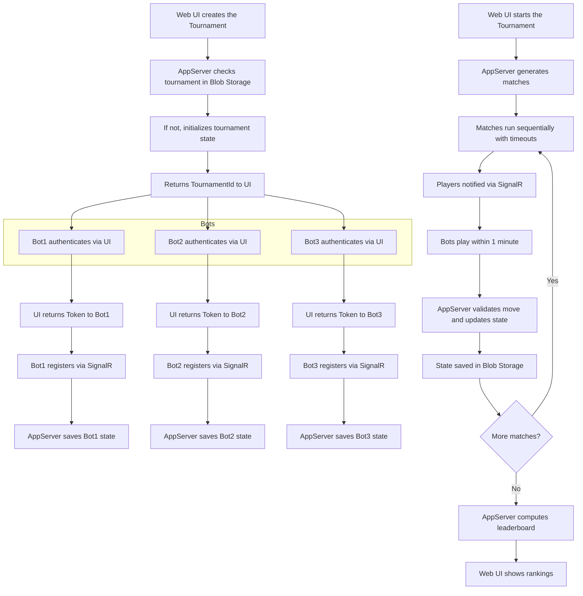

# Code Challenge - 2025/04

## Welcome Aboard, Bot Designer!

Welcome to the **TicTacToe Tournament**, a modern .NET 8 application for managing automated bot competitions.

This system includes a user interface built with ASP.NET MVC that allows users to manage tournaments and spectate live matches. At the core of the communication architecture is **SignalR**, enabling real-time interaction between the UI and the participating bots.

The backend is composed of two services:
- **Web UI**: ASP.NET MVC site
- **AppServer**: SignalR hub orchestrator and persistence engine

Both services are deployed to [Azure Container Instances](https://learn.microsoft.com/en-us/azure/container-instances/container-instances-overview) and communicate in real time via SignalR.

The **AppServer** hosts the SignalR Hub, handling all real-time communication. The **Web UI** allows users to create tournaments, monitor games, and manage players. Both services rely on SignalR for real-time low-latency communication.

To simplify persistence, tournament state is saved as JSON files within [Azure Blob Storage](https://learn.microsoft.com/en-us/azure/storage/blobs/storage-blobs-introduction). Each tournament has its own folder inside the `games` container, containing files like `tournament.json`, `players.json`, etc.

> **Note:** An [Azure Blob Storage Lifecycle Management](https://learn.microsoft.com/en-us/azure/storage/blobs/lifecycle-management-overview) policy automatically deletes old tournaments **after 4 hours**, optimizing storage usage.

---

## Authentication Flow

This sequence shows how the Web UI creates a tournament and how bots join using SignalR. All communication is persisted through Azure Blob Storage.

---

## Tournament Lifecycle Flow

Matches follow a home/away format. Each bot competes at least twice against each opponent. Timeouts, draws, and forfeits are handled programmatically.

| Result   | Points |
|----------|--------|
| Win      |   3    |
| Draw     |   1    |
| Loss     |   0    |
| Forfeit  |  -1    |

---

## ❓ FAQ

<strong>How do I create a bot for the TicTacToe Tournament?</strong>

See [How to Create a Bot.md](./How-To-Create-A-Bot.md). It provides everything you need to build a bot that integrates with the tournament engine.

<strong>Where do I find the tournament architecture and SignalR setup?</strong>

In this [README.md](./README.md) there's an in-depth explanation of the system design, tournament flows, and infrastructure.

<strong>What’s SignalR and Azure SignalR Offering?</strong>

[SignalR](https://learn.microsoft.com/aspnet/core/signalr/introduction) is a real-time communication library for ASP.NET. It simplifies bi-directional communication between client and server.

The [Azure SignalR Service](https://learn.microsoft.com/azure/azure-signalr/signalr-overview) offers a managed, scalable infrastructure for SignalR apps, handling scale-out, connections, and backplane messaging.

<strong>How Does SignalR Relate to AWS SQS and Kafka?</strong>

While [SignalR](https://learn.microsoft.com/aspnet/core/signalr/introduction) is ideal for **real-time** messaging between clients and servers, [AWS SQS](https://aws.amazon.com/sqs/) and [Apache Kafka](https://kafka.apache.org/) focus on **asynchronous**, **durable**, and **scalable** messaging.

SignalR is designed for scenarios requiring immediate feedback — like games or chat. Kafka and SQS excel in high-throughput, distributed, fault-tolerant data streaming.

You can combine SignalR with Azure services like:
- [Azure Service Bus](https://learn.microsoft.com/azure/service-bus-messaging/service-bus-messaging-overview)
- [Azure Event Hubs](https://learn.microsoft.com/azure/event-hubs/event-hubs-about)
- [Azure Event Grid](https://learn.microsoft.com/azure/event-grid/overview)

to support observability, guaranteed delivery, dead-lettering, and retries.

