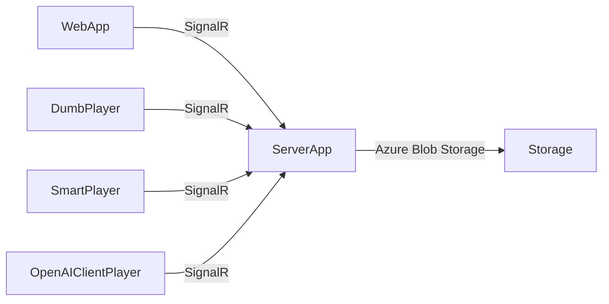

# TicTacToe Tournament - Architecture

Welcome to the **TicTacToe Tournament** project! This document provides a high-level overview of the system architecture.

---

# 📊 System Overview

TicTacToe Tournament is a real-time, scalable tournament platform built with **.NET 8**, **SignalR**, **Azure**, and **Docker**.

It allows multiple players (bots or human clients) to register in a tournament, and plays matches in real-time.

---

# 🌍 Components

| Component | Description |
|:---|:---|
| **ServerApp** | Hosts the SignalR Hub, manages tournaments, matches, and player state. Connects to Azure services if configured. |
| **WebApp** | Admin and Monitoring Web Interface. Allows creating, starting, canceling tournaments, and watching matches live. |
| **Player Bots** | SmartPlayer, DumbPlayer, and OpenAIClientPlayer. Each bot connects to the ServerApp and plays autonomously. |
| **Azure Storage** | (Optional) Persist tournament data (e.g., matches, player lists) to Azure Blob Storage. |


---

# 🔗 Communication Flow

Mermaid Diagram:



- WebApp and Player Bots **connect via SignalR**.
- ServerApp orchestrates matches and game turns.
- ServerApp optionally **persists state** in Azure Blob Storage.


---

# 🛠️ Main Technologies

- **.NET 8**
- **ASP.NET Core SignalR**
- **Entity Framework (internal usage)**
- **Azure Blob Storage** (optional persistence)
- **Docker** (containerized deployment)
- **Playwright** (future UI testing)


---

# 📊 Repository Structure

```
TicTacToe.Tournament
├── Models/            # Core models: Tournament, Match, Player, etc.
├── Server/            # Server-side logic (SignalR Hub, GameServer)
├── WebApp/            # Web-based administration UI
├── Player/            # BasePlayer + DumbPlayer + SmartPlayer + OpenAIClientPlayer
├── Tests/             # Unit tests and Playwright tests
└── docs/              # Documentation (this folder)
```


---

# 💡 Future Improvements

- Match replay storage and visualization.
- Bot leaderboards and statistics.
- Multi-round tournaments.
- Full Docker Compose stack.
- Azure DevOps/GitHub Actions CI/CD pipeline.


---

# 📢 Feedback

If you have suggestions to improve the architecture or new ideas, feel free to open an [Issue](https://github.com/rzavalik/TicTacToe.Tournament/issues).

Let's build it better together! ✨

